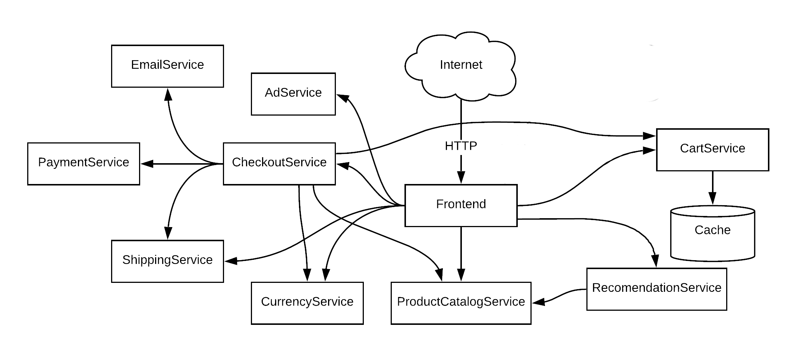

# Actor4j Cloud – Demo Application #

The microservices demo "Online Boutique" [[1](#1)] (Apache-2.0 license) of Google Cloud Platform is used as a reference implementation (older version). Adaptations and necessary reimplementation were made for a proof of concept for Actor4j Cloud (here, using a single instance approach). For further reading, have a look at the research paper [[2](#2)].

Fig. 1: Services of the demo application (adapted from [[1](#1)]) and realized as `ActorPods`

# References #

[1]<a name="1"/>Google Cloud Platform, “microservices-demo: Sample cloud-first application with 10 microservices showcasing Kubernetes, Istio, and gRPC.” Available: https://github.com/GoogleCloudPlatform/microservices-demo.

[2]<a name="2"/>D. A. Bauer and J. Mäkiö, “Actor-Oriented Scalable Domain-Specific Cluster Architecture for Cloud-Applications,” in IECON 2022 – 48th Annual Conference of the IEEE Industrial Electronics Society, Oct. 2022, pp. 1–6. doi: 10.1109/IECON49645.2022.9968983. Available: https://ieeexplore.ieee.org/document/9968983.